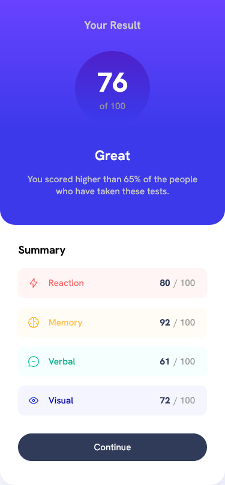
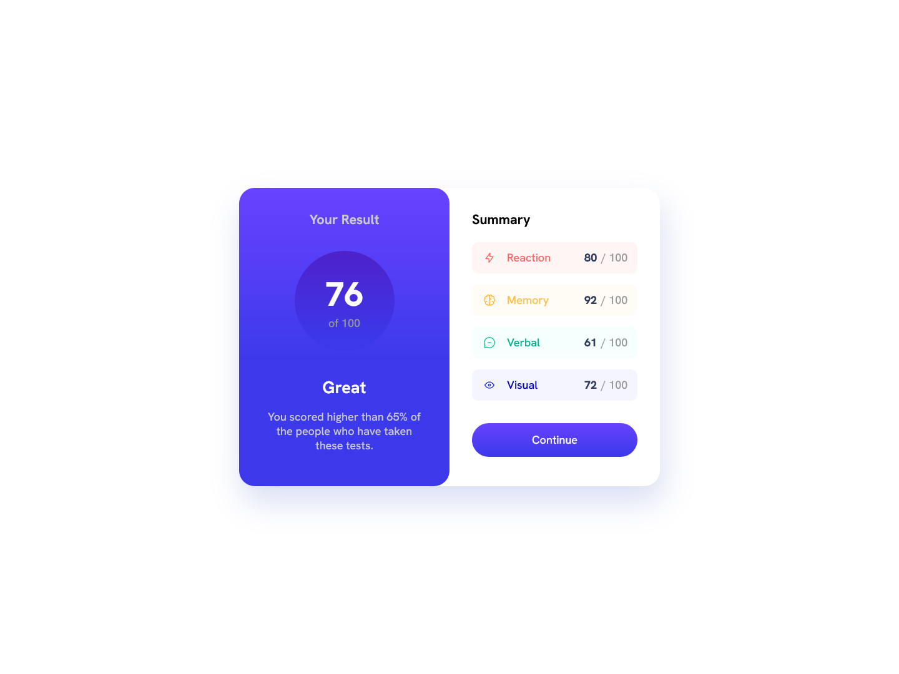

# Frontend Mentor - Results summary component solution

This is a solution to the [Results summary component challenge on Frontend Mentor](https://www.frontendmentor.io/challenges/results-summary-component-CE_K6s0maV). Frontend Mentor challenges help you improve your coding skills by building realistic projects. 

## Table of contents

  - [Screenshot](#screenshot)
  - [Links](#links)
- [My process](#my-process)
  - [Built with](#built-with)
  - [What I learned](#what-i-learned)
  - [Continued development](#continued-development)
  - [Useful resources](#useful-resources)
- [Author](#author)
- [Acknowledgments](#acknowledgments)

**Note: Delete this note and update the table of contents based on what sections you keep.**

### Screenshot

### Links

- Solution URL: [GitHub](https://github.com/TheGroobi/Results-summary-component)
- Live Site URL: [Vercel](https://results-summary-component-psi-tan.vercel.app/)

## My process
    First I wanted to align the component using flexbox, but it kept breaking so i had to look for other solutions. I ended up aligning it with grid and setting fixed widths, which i know is not ideal, but i couldn't get anything else to work.
    The rest was pretty easy, just some issues with margins/padding and media queries for mobile. Also i forgot to use :nth-of-child selectors which made my life a pain near the end but, i'm already too deep and don't wanna think about fixing it rn i might do it later/some day.
### Built with

- Semantic HTML5 markup
- CSS custom properties
- Flexbox
- CSS Grid

### What I learned

The main thing i learnt was using grid, which i was ignoring for a long time. I feel like this project was meant to be built with grid, so that's what i did. I also revised how to effectively use media queries. The rest i pretty much already knew and just used my previous knowledge.
### Continued development

Still need to use more display: grid; to get a better hang of it. Not used to it at all. 

### Useful resources

- [Gradient](https://developer.mozilla.org/en-US/docs/Web/CSS/gradient/linear-gradient) - Self explanatory guide for linear gradient needed in this challenge.
- [Notes](https://developer.mozilla.org/en-US/docs/Web/CSS/Comments) - Forgot how to make notes, found this very useful. 
- [Grid](https://www.w3schools.com/cssref/tryit.php?filename=trycss_grid-column) - Help me fix some issues with grid.
- [Media Queries](https://www.w3schools.com/css/css_rwd_mediaqueries.asp) - Really helped me understand media queries, and figure out how to align items with grid on a mobile width.
- [Different Colored Elements](https://stackoverflow.com/questions/69465622/hello-how-can-i-put-different-colors-in-a-p-element) - I forgot that :nth-of-child selector existed so i used spans, like in this Stack Overflow question. It's not the best solution, but i guess it works for now.

## Author

- Frontend Mentor - [@TheGroobi](https://www.frontendmentor.io/profile/TheGroobi)

## Acknowledgments

Pozdro dla Dawidka, dzięki za pomoc szef.
